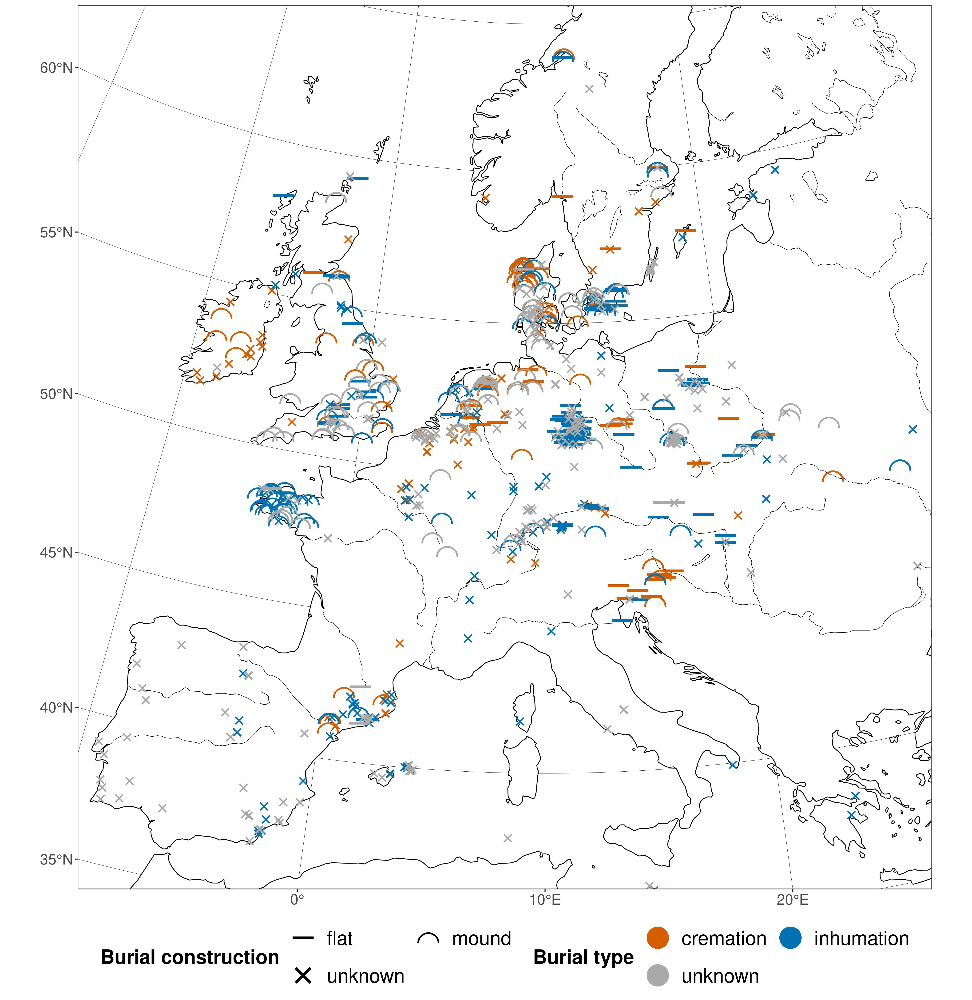
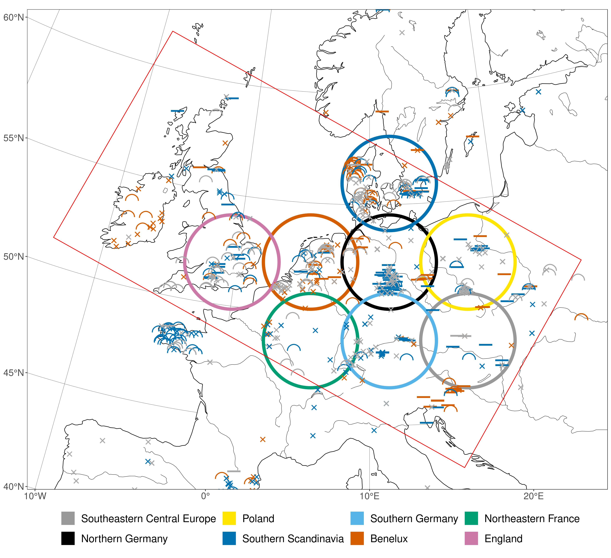
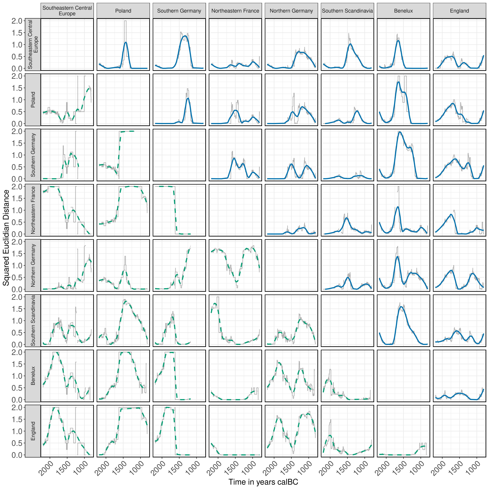
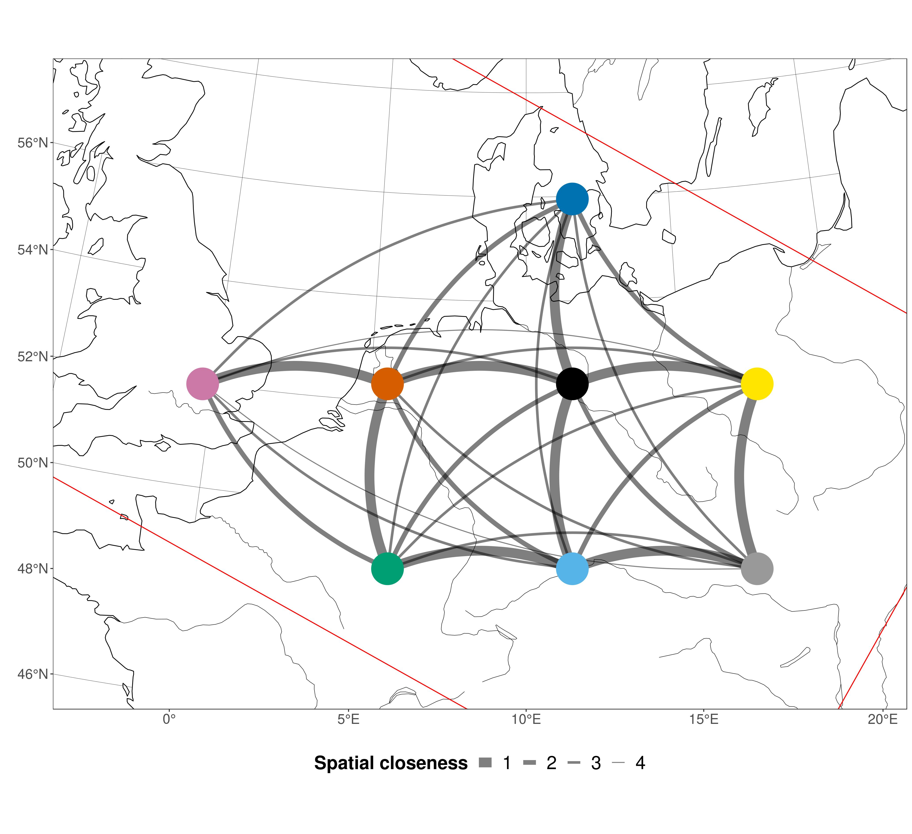
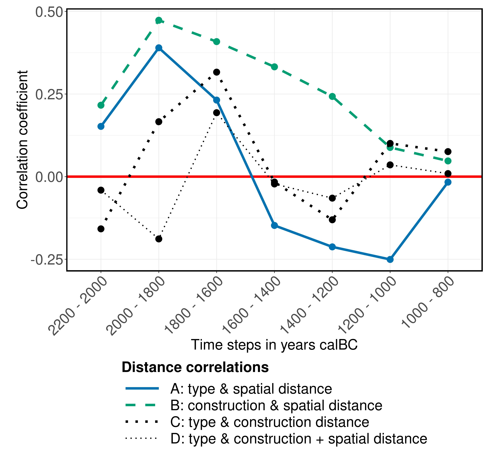

```{r, echo = FALSE}
# https://stackoverflow.com/questions/25646333/code-chunk-font-size-in-rmarkdown-with-knitr-and-latex
def.chunk.hook  <- knitr::knit_hooks$get("chunk")
knitr::knit_hooks$set(chunk = function(x, options) {
  x <- def.chunk.hook(x, options)
  ifelse(options$size != "normalsize", paste0("\\", options$size,"\n\n", x, "\n\n \\normalsize"), x)
})
knitr::opts_chunk$set(echo = TRUE, cache = TRUE)
```

# Introduction

## Radiocarbon dates on graves

\textblockcolour{mDarkTeal}

{ height=85% }

\begin{textblock*}{65pt}(5pt,40pt)
  \textblockcolour{niceorange}
  \setlength\fboxrule{2pt}%
  \noindent\fbox{%
    \begin{minipage}{\linewidth - 2\fboxsep - 2\fboxrule}%
      \raggedright\footnotesize\color{white}
      \textbf{Radon-B:} Database of \textsuperscript{14}C dates for the European Bronze Age
    \end{minipage}}%
\end{textblock*}

\begin{textblock*}{65pt}(5pt,100pt)
  \setlength\fboxrule{2pt}%
  \noindent\fbox{%
    \begin{minipage}{\linewidth - 2\fboxsep - 2\fboxrule}%
      \raggedright\footnotesize\color{white}
      \textsuperscript{14}C dating is an important absolute dating method: One date equals a \textbf{fuzzy point in space and time with context information}
    \end{minipage}}%
\end{textblock*}

\textblockcolour{}

\begin{textblock*}{65pt}(290pt,40pt)
  \includegraphics{figures/burial_rites_clipart.png}
\end{textblock*}

\textblockcolour{mDarkTeal}

## Dates on graves through time

\begin{adjustwidth}{-3em}{-3em}
  \begin{figure}
    \includegraphics{figures/general_map_research_area_timeslices.jpeg}
    \caption{Plot matrix of radiocarbon dates on graves through time.}
  \end{figure}
\end{adjustwidth}

\begin{textblock*}{65pt}(295pt,210pt)
  \setlength\fboxrule{2pt}%
  \noindent\fbox{%
    \begin{minipage}{\linewidth - 2\fboxsep - 2\fboxrule}%
      \raggedright\footnotesize\color{white}
      Heterogeneous \textbf{information density} in space and time
    \end{minipage}}%
\end{textblock*}

# Regional time series of Bronze Age burial rites

## Artificial macro-regions

{ height=85% }

\begin{textblock*}{75pt}(30pt,140pt)
  \setlength\fboxrule{2pt}%
  \noindent\fbox{%
    \begin{minipage}{\linewidth - 2\fboxsep - 2\fboxrule}%
      \raggedright\footnotesize\color{white}
      Separation into eight \textbf{artificial regions} within the area of the highest data density
    \end{minipage}}%
\end{textblock*}

## Burial Rites: Development in absolute numbers

\begin{columns}
  \begin{column}{0.48\textwidth}  
    \begin{figure}
      \includegraphics{figures/development_amount_regions_burial_type.jpeg}
      \caption{\textbf{burial type} development: Sum of \textsuperscript{14}C dates whose $2\sigma$ range cover the respective year.}
    \end{figure}
  \end{column}
  \begin{column}{0.35\textwidth}
    \begin{figure}
      \includegraphics{figures/development_amount_regions_burial_construction.jpeg}
      \caption{\textbf{burial construction}}
      \vspace{1.8cm}
    \end{figure}
  \end{column}
\end{columns}

\begin{textblock*}{120pt}(215pt,220pt)
  \setlength\fboxrule{2pt}%
  \noindent\fbox{%
    \begin{minipage}{\linewidth - 2\fboxsep - 2\fboxrule}%
      \raggedright\footnotesize\color{white}
      Data structure transformation: Individual \textsuperscript{14}C dates to region wise \textbf{time series} of burial rite \textbf{presence}
    \end{minipage}}%
\end{textblock*}

## Burial Rites: Development in relative proportions

\begin{columns}
  \begin{column}{0.48\textwidth}
    \begin{figure}
      \includegraphics{figures/development_proportions_regions_burial_type.jpeg}
      \caption{\textbf{burial type} development: Year wise proportions of dates. \textit{unknown} is filtered out.}
    \end{figure}
  \end{column}
  \begin{column}{0.35\textwidth}
    \begin{figure}
      \includegraphics{figures/development_proportions_regions_burial_construction.jpeg}
      \caption{\textbf{burial construction}}
      \vspace{1.8cm}
    \end{figure}
  \end{column}
\end{columns}

\begin{textblock*}{120pt}(215pt,220pt)
  \setlength\fboxrule{2pt}%
  \noindent\fbox{%
    \begin{minipage}{\linewidth - 2\fboxsep - 2\fboxrule}%
      \raggedright\footnotesize\color{white}
      Data structure transformation: Time series of absolute appearances to \textbf{time series} of burial rite \textbf{proportions} -- \textbf{burial rite proxy}
    \end{minipage}}%
\end{textblock*}

# Cultural and spatial distance

## Measuring cultural distance

**Question:** How do the developments in these regions for **burial type** and **burial construction** relate to each other? Which regions behave alike?

\usebeamertemplate*{title separator}

The **Squared Euclidian Distance** is a a simple **measure of between-group similarity** that can be applied to the **burial rite proxy** data.

\huge $$d_{ij}^2 = \sum_{k = 1}^{n} (p_{ik} - p_{jk})^2$$ \normalsize

- $d_{ij}^2$: Squared Euclidean Distance between two groups $i$ and $j$
- $k$: Variant counter
- $n$: Total amount of variants in a population
- $p_{ik}$: Relative frequency of the $k$'th variant in population $i$
- $p_{jk}$: Relative frequency of the $k$'th variant in population $j$

## Cultural distance matrix

{ height=85% }

\begin{textblock*}{65pt}(5pt,40pt)
  \textblockcolour{niceorange}
  \setlength\fboxrule{2pt}%
  \noindent\fbox{%
    \begin{minipage}{\linewidth - 2\fboxsep - 2\fboxrule}%
      \raggedright\footnotesize\color{white}
      The \textbf{SED} can be calculated for every year of every one of the $8*8=64$ region relationships
    \end{minipage}}%
\end{textblock*}

\begin{textblock*}{65pt}(5pt,140pt)
  \setlength\fboxrule{2pt}%
  \noindent\fbox{%
    \begin{minipage}{\linewidth - 2\fboxsep - 2\fboxrule}%
      \raggedright\footnotesize\color{white}
      \textbf{burial construction}:
      Heterogeneous distance development
    \end{minipage}}%
\end{textblock*}

\begin{textblock*}{65pt}(295pt,40pt)
  \setlength\fboxrule{2pt}%
  \noindent\fbox{%
    \begin{minipage}{\linewidth - 2\fboxsep - 2\fboxrule}%
      \raggedright\footnotesize\color{white}
      \textbf{burial type}:
      Low distance at the start and end due to the \textbf{universal shift from inhumation to cremation} with rise of the \textbf{Urnfield culture}
    \end{minipage}}%
\end{textblock*}

\begin{textblock*}{65pt}(295pt,140pt)
  \setlength\fboxrule{2pt}%
  \noindent\fbox{%
    \begin{minipage}{\linewidth - 2\fboxsep - 2\fboxrule}%
      \raggedright\footnotesize\color{white}
      The different \textbf{adoption rates} are visible as \textbf{peaks of cultural distance}
    \end{minipage}}%
\end{textblock*}

## Spatial distance

{ height=85% }

\begin{textblock*}{100pt}(15pt,50pt)
  \setlength\fboxrule{2pt}%
  \noindent\fbox{%
    \begin{minipage}{\linewidth - 2\fboxsep - 2\fboxrule}%
      \raggedright\footnotesize\color{white}
      The definition of artificial regions as units of analysis makes distance measures difficult. \textbf{Ordinally scaled distance classes} are the only valid option here.
    \end{minipage}}%
\end{textblock*}

## Correlation of cultural and spatial distance

{ height=85% }

\begin{textblock*}{50pt}(10pt,40pt)
  \setlength\fboxrule{2pt}%
  \noindent\fbox{%
    \begin{minipage}{\linewidth - 2\fboxsep - 2\fboxrule}%
      \raggedright\footnotesize\color{white}
      \textbf{A:} Weak correlation in the EBA, negative 
      correlation from the LBA
    \end{minipage}}%
\end{textblock*}

\begin{textblock*}{50pt}(10pt,120pt)
  \setlength\fboxrule{2pt}%
  \noindent\fbox{%
    \begin{minipage}{\linewidth - 2\fboxsep - 2\fboxrule}%
      \raggedright\footnotesize\color{white}
      \textbf{B:} Slightly stronger correlation in the EBA, no
      correlation in the LBA 
    \end{minipage}}%
\end{textblock*}

\begin{textblock*}{50pt}(305pt,40pt)
  \setlength\fboxrule{2pt}%
  \noindent\fbox{%
    \begin{minipage}{\linewidth - 2\fboxsep - 2\fboxrule}%
      \raggedright\footnotesize\color{white}
      \textbf{C\&D:} No significant correlation 
    \end{minipage}}%
\end{textblock*}

# Conclusion

## Observations and hypotheses

- The **main trends** in the distribution of burial rites in Bronze Age Europe **can be detected** in **bulk radiocarbon data**

- The diffusion of the **cremation funeral tradition** and **traditions of flat vs. mound graves** are **mostly independent**

- Both processes are **mostly independent** of **spatial distance**, except for some time periods in the Early Bronze Age

- **Big phenomena** like the ones initiated by **Tumulus culture** and **Urnfield culture** do not spread in simple diffusion processes

- **Other interaction networks** could yield better predictions: Elite Networks, Religious superstructures, ...

## Simulation

\begin{columns}
  \begin{column}{0.57\textwidth}
    A population based idea transmission model
    \newline
    \begin{figure}
      \includegraphics{figures/sim_final_result_spatial.jpeg}
    \end{figure}
  \end{column}
  \begin{column}{0.43\textwidth}
    \begin{figure}
      \includegraphics{figures/code_sample_II_relations_generation.jpg}
    \end{figure}
    \begin{figure}
      \includegraphics{figures/code_sample_III_idea_generation.jpg}
    \end{figure}
  \end{column}
\end{columns}

##

\titlepage
  
